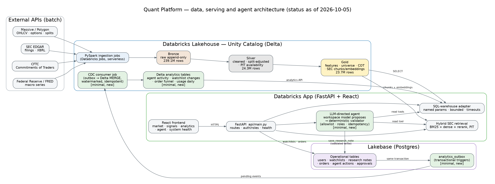

# Quant Platform — point-in-time research, retrieval and paper-trading on Databricks

A Databricks-native application for mid-frequency equity research. It ingests market, options, SEC, COT and macro data
with PySpark into a Delta medallion lakehouse, serves it through a FastAPI + React Databricks App, lets an LLM-directed
agent research a company and save a note through validated tools, and records user and agent activity in Lakebase
(Postgres) for an analytics pipeline back into Delta.

**Live app:** https://quant-platform-dev-1352785079224954.aws.databricksapps.com (Databricks workspace login required)



Diagram source: [`docs/proposal/architecture.dot`](docs/proposal/architecture.dot). Detailed write-up:
[`docs/proposal/CAPSTONE.md`](docs/proposal/CAPSTONE.md).

---

## Capstone rubric coverage

| Requirement | How it is met | Status |
|---|---|---|
| Spark data pipeline | PySpark bronze ingestion + silver/gold transforms on Databricks serverless jobs (`notebooks/`, `pipelines/`, `silver/`, `gold/`) | Implemented, run |
| Third-party APIs | Massive/Polygon (OHLCV, options, splits), SEC EDGAR, CFTC COT, Federal Reserve/FRED | Implemented, run |
| Two Big Data Vs | **Volume:** 287.1M rows (239.1M bronze) · **Variety:** structured prices/options/COT/macro + unstructured SEC filing text | Measured 2026-10-05 |
| Lakebase data model | 8+ relational tables (`db/migrations/`): users, watchlists, research notes, orders, executions, positions, agent actions, approvals | Implemented |
| Action-taking AI agent | Workspace model proposes a tool call → deterministic validator (allowlist, roles, write scope, idempotency) → read tools + `save_research_note` | Implemented, demonstrated live |
| Analytics pipeline | Lakebase transactional outbox → watermarked, idempotent Delta MERGE job → 4 analytics tables → analytics API | Implemented, run live |
| Frontend | React + Vite + Tailwind: market, signals, analytics, agent, system health | Implemented |
| Deployed application | Databricks App with SQL-warehouse data path, Lakebase resilience and health diagnostics | Deployed, healthy |

Volume evidence: live `COUNT(*)` of every table at 2026-10-05 03:41 UTC in
[`docs/proposal/row_counts_2026-10-05.tsv`](docs/proposal/row_counts_2026-10-05.tsv)
(largest: `bronze_options_day` 152.1M, `bronze_ohlcv` 73.3M, `silver_ohlcv` 23.4M, `gold_ohlcv_features` 23.4M).

## Honest status

| Capability | Code | Tested | Deployed / run |
|---|---|---|---|
| Batch Spark ingestion + medallion | Yes | Yes | Run (287M rows) |
| Split-adjusted daily prices (Massive corporate actions) | Yes | Yes | Run |
| SEC hybrid retrieval (BM25 + dense + rerank, point-in-time) | Yes | Yes | Run — 16 semiconductor tickers embedded; universe-wide rollout pending ([#28](https://github.com/evangoh122/quant_platform_1/pull/28)) |
| SEC knowledge graph + governed NL analytics contracts | Yes | Yes | Merged |
| Databricks App (FastAPI + React), warehouse data path, health/trace | Yes | Yes | **Deployed and verified 2026-10-05** — `/api/health`: Lakebase ok, SQL warehouse ok |
| Lakebase writes from the app | Yes | Yes | **Live** — app service principal has `CAN_USE` + a least-privilege Postgres role |
| LLM-directed agent (research → save note) | Yes (minimal) | Offline + live | **Live run 2026-10-05**: `search_sec_filings(NVDA)` → `save_research_note` written to Lakebase, logged in `agent_actions` |
| Lakebase → Delta analytics (outbox CDC) | Yes (minimal) | Offline + real Postgres + live | **Live run 2026-10-05**: outbox → `lakebase_change_events` (9) → all four analytics tables populated |
| Trading signals (`gold_trading_signals` → Signals page) | Yes | Yes | **35 baseline signals published 2026-10-05** by `scripts/publish_baseline_signals.py` (logistic regression on `gold_model_features`; hold-out AUC 0.47 — pipeline demonstration, no predictive edge claimed) |
| Streaming DLT pipeline | Yes | Local validation | Not deployed or run |
| Trading strategies (residual reversion, options, technical) | Partial | Yes | Research only — no profitability claim |
| IBKR paper execution | Scaffold | Partial | Not live |

## Core workflow

1. Ingestion jobs pull from the external APIs into **bronze** Delta tables (append-only, ingest timestamps).
2. **Silver** cleans, deduplicates, split-adjusts prices and stamps `information_available_ts` for point-in-time joins.
3. **Gold** builds features, the tradable universe, COT positioning and SEC chunk embeddings.
4. The **Databricks App** reads gold through a bounded, parameterised SQL-warehouse adapter and serves the React UI.
5. The **agent** retrieves SEC passages and market features (as data, never as instructions) and can save a research note
   through a validated, idempotent Lakebase write that is recorded in `agent_actions`.
6. Every Lakebase write also lands in `analytics_outbox` in the same transaction; a Delta job merges those events into
   analytics tables that the app's analytics page reads.

## Repository layout

| Path | Purpose |
|---|---|
| `api/` | FastAPI app (`api/main.py` is the production entry point), routes, services |
| `frontend/` | React + Vite + Tailwind SPA |
| `agent/` | Agent runtime, tool contracts, retrieval and write tools, guardrails |
| `db/` | SQL-warehouse adapter, Lakebase client, schema contract, Postgres migrations |
| `notebooks/`, `pipelines/`, `silver/`, `gold/` | Ingestion jobs and medallion transforms |
| `resources/`, `databricks.yml`, `app.yaml` | Databricks Asset Bundle: jobs, app, resources |
| `strategies/`, `ml/` | Research code (backtests, evidence, models) |
| `evals/` | RAG evaluation harness |
| `tests/` | Offline test suite |
| `docs/` | Deployment, runbooks, data schemas, proposal |

## Local development

```bash
pip install -r requirements.txt -r requirements-dev.txt
python -m pytest -q -m "not spark and not lakebase and not databricks"   # offline suite
cd frontend && npm ci && npm test -- --run && npm run build
uvicorn api.main:app --reload
```

Configuration comes from environment variables / bundle variables (`CATALOG`, `SCHEMA`, `DATABRICKS_WAREHOUSE_ID`,
`LAKEBASE_INSTANCE`, `AGENT_MODEL_ENDPOINT`); no credentials are committed. Secrets live in a Databricks secret scope.

## Databricks deployment

```bash
databricks bundle validate -t dev
databricks bundle deploy -t dev
# Then Deploy the app in Databricks Apps; grant the app service principal Lakebase access (docs/DEPLOYMENT.md)
python scripts/smoke_app.py --base-url <app-url>
```

## Engineering process

Changes were built by a coding agent, independently checked by a second model (with mutation tests that must fail on
the old code), reviewed by a third, and validated live against the Databricks workspace before merge; every PR also
received a CodeRabbit review. Security: dependency audit (`pip-audit`, `npm audit`) and secret scanning run in CI —
see [`docs/SECURITY.md`](docs/SECURITY.md).

## Known limitations

- SEC retrieval covers 16 tickers until the universe-wide ingest (#28) is rolled out.
- The agent and the analytics pipeline are minimal versions built for the capstone deadline (one DeepSeek check + live validation; a Codex review is pending). The analytics job is run on demand (it needs a short-lived `LAKEBASE_URL` at run time).
- Macro (Fed) series are revised values, not first-release vintages.
- Strategy research reports are descriptive; several are marked `BLOCKED_DATA` (fewer than two complete out-of-sample years).
- The streaming DLT pipeline is built but not deployed.
- Published signals come from an untuned baseline model (hold-out AUC 0.47, all directions UP); they demonstrate the features → model → `gold_trading_signals` → app path, not a trading edge.
