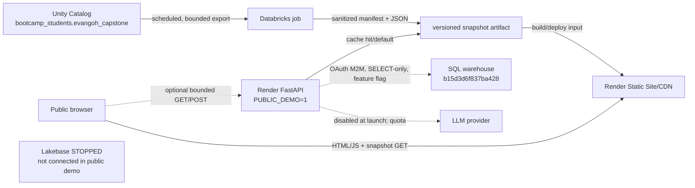

# Render deployment plan (public, read-only capstone demo)

Status: planning only. This document does not authorize a deployment. It assumes Unity Catalog catalog/schema `bootcamp_students.evangoh_capstone`, SQL warehouse `b15d3d6f837ba428`, and a stopped/unavailable Lakebase. No personal access token is permitted.

## Decision

Use a **snapshot-first hybrid**:

1. A Render Static Site serves the React/Vite application and versioned, read-only snapshot JSON. This is the public experience and must remain useful when the API, SQL warehouse, service principal (SP), or LLM is unavailable.
2. An optional free Render FastAPI Web Service supplies only health and tightly bounded read-only functionality. It may serve the same snapshot files initially. Live Unity Catalog reads stay disabled until an admin-created SP has least-privilege access and the code has moved from PySpark to the Databricks SQL connector with OAuth M2M.
3. RAG is precomputed initially. A live RAG endpoint is a later, explicitly budgeted feature; it is not required for launch.

This best fits a public demo: the shell and core evidence load from the CDN without a Render cold start, an absent SP does not block launch, and neither Lakebase nor a live warehouse/LLM sits on the default request path.

## 1. Architecture options

| Option | Cost and cold start | SP dependency | Security/cost surface | Verdict |
| --- | --- | --- | --- | --- |
| **A. Static frontend + live FastAPI/Databricks SQL** | Static shell is fast, but first API request waits for the free web service and possibly a stopped SQL warehouse. Every cache miss can incur DBU/warehouse cost. | Hard dependency for useful data. The SP may not exist yet. | OAuth secret on Render; public query surface; query amplification and warehouse spend; live RAG may add LLM spend. Lakebase still cannot be used. | Do not use as the launch architecture. Consider only for a few bounded endpoints later. |
| **B. Snapshot-only static site** | Cheapest and fastest. CDN serves prebuilt JSON/Parquet-derived JSON; no application cold start or visitor-triggered compute. The scheduled producer, not traffic, controls spend. | Render needs no SP. The Databricks export job runs under a Databricks job identity/SP configured in Databricks, once available. A manually generated reviewed snapshot can bootstrap launch. | Smallest public surface: GET-only immutable artifacts. Main risks are stale data and accidental sensitive fields in exports. | Safest launch fallback and acceptable by itself. |
| **C. Snapshot-first hybrid** | Core pages are CDN-fast; optional API cold start affects only enhancements. Fixed snapshot cadence bounds Databricks cost; API caching bounds any live cost. | No SP needed for the public snapshot experience. SP needed only for export automation and optional live SQL. | Slightly more operational complexity than B, but live features can be feature-flagged off and fail back to snapshots. | **Recommended.** It preserves a credible interactive path without making the showcase depend on Lakebase, the SP, or always-on paid compute. |

### Target data flow



Snapshot contents should be an allowlisted bundle, not a database dump:

- `manifest.json`: schema version, generated timestamp, source maximum timestamps, row counts, producer commit/run ID, and checksums.
- `results.json`: canonical r4 net metrics, fold-level walk-forward results, and caveats.
- `ablation.json`: real-data results when available; otherwise clearly labeled synthetic pipeline validation from `ml/results/ablation_abcd.md`.
- `universe.json`, `regime.json`, `freshness.json`, bounded chart series, and `rag_samples.json` containing reviewed question/answer/citations/`as_of` records.
- No user, order, approval, account, position, raw prompt, secret, proprietary entitlement, or unrestricted filing text fields.

The job should write a complete bundle to a new versioned prefix, validate it, then atomically publish a small `latest.json` pointer. Retain the last known-good bundle. Render must serve/copy an already exported artifact and must not query UC during a visitor request or require a Databricks credential in browser code. The owner must choose the artifact handoff (for example, a versioned object-store bucket readable only by build automation, or an automated PR containing the small sanitized JSON); see open questions.

## 2. Exact Render setup

The recommended repository change is a root `render.yaml` with two services. The API is optional for launch but specified now so it is reproducible. Replace the two placeholder hostnames before creating the Blueprint. Render-generated URLs are configuration, not secrets.

```yaml
services:
  - type: web
    name: qp1-demo-api
    runtime: python
    plan: free
    region: singapore
    buildCommand: pip install --upgrade pip && pip install -r requirements.txt -r requirements-app.txt
    startCommand: uvicorn api.main:app --host 0.0.0.0 --port $PORT --workers 1
    healthCheckPath: /api/health/live
    autoDeployTrigger: commit
    envVars:
      - key: PYTHON_VERSION
        value: 3.11.11
      - key: APP_ENV
        value: production
      - key: PUBLIC_DEMO
        value: "1"
      - key: DATA_MODE
        value: snapshot
      - key: SNAPSHOT_DIR
        value: /opt/render/project/src/public/snapshots
      - key: CORS_ORIGINS
        value: https://qp1-demo.onrender.com
      - key: CACHE_TTL_SECONDS
        value: "900"
      - key: CACHE_STALE_IF_ERROR_SECONDS
        value: "86400"
      - key: RATE_LIMIT_READS
        value: 60/minute
      - key: RATE_LIMIT_RAG
        value: 3/hour
      - key: LIVE_SQL_ENABLED
        value: "0"
      - key: LIVE_RAG_ENABLED
        value: "0"
      - key: DATABRICKS_HTTP_PATH
        value: /sql/1.0/warehouses/b15d3d6f837ba428
      - key: DATABRICKS_HOST
        sync: false
      - key: DATABRICKS_CLIENT_ID
        sync: false
      - key: DATABRICKS_CLIENT_SECRET
        sync: false
      - key: REDIS_URL
        sync: false
      - key: LLM_API_KEY
        sync: false

  - type: web
    name: qp1-demo
    runtime: static
    buildCommand: cd frontend && npm ci && npm run build
    staticPublishPath: ./frontend/dist
    autoDeployTrigger: commit
    envVars:
      - key: VITE_API_BASE_URL
        value: https://qp1-demo-api.onrender.com
    headers:
      - path: /*
        name: X-Content-Type-Options
        value: nosniff
      - path: /*
        name: Referrer-Policy
        value: strict-origin-when-cross-origin
      - path: /*
        name: Content-Security-Policy
        value: "default-src 'self'; connect-src 'self' https://qp1-demo-api.onrender.com; img-src 'self' data:; style-src 'self' 'unsafe-inline'; script-src 'self'"
    routes:
      - type: rewrite
        source: /*
        destination: /index.html
```

Before using the Blueprint, verify Render's currently supported `region`, `autoDeployTrigger`, and static-site schema; Blueprint syntax can evolve. Do not put actual secret values in the YAML. If snapshot-only launch is chosen, omit `qp1-demo-api`, set the frontend to local `/snapshots`, and remove the external `connect-src`.

### Required repository/build changes (future implementation, not performed here)

- Add the above `render.yaml` at repository root. Existing `app.yaml` remains Databricks-App-specific and is not used by Render.
- Keep the frontend as a **separate Static Site**. Change `frontend/src/api/client.ts` to read `VITE_API_BASE_URL`, support a snapshot adapter, and fall back to the last-known-good snapshot. Copy/download the validated snapshot bundle into `frontend/public/snapshots/` before `vite build` (or commit reviewed, small artifacts there). Never expose Databricks or LLM credentials as `VITE_*` variables.
- Add `GET /api/health/live`, which only proves the process is alive and performs no Lakebase, warehouse, outbound, or token call. Keep dependency readiness at a separate operator endpoint if needed. Current `GET /api/health` attempts Lakebase and would make every Render health probe repeatedly hit a stopped service.
- Add the Databricks SQL connector dependency and a new read-only SQL adapter using OAuth M2M. Current `db/delta_adapter.py` / `agent/tools_retrieval.py` use `SparkSession`; PySpark availability on Render is neither a UC connection nor an appropriate serving mechanism. Configure server hostname from `DATABRICKS_HOST` and HTTP path `/sql/1.0/warehouses/b15d3d6f837ba428`.
- Add a snapshot loader with schema/checksum validation and last-known-good behavior. Parquet can be an internal export format, but emit bounded JSON for direct browser use to avoid shipping a large Parquet runtime.
- Make the API package install deterministic. Confirm whether both `requirements.txt` and `requirements-app.txt` are required; pin/lock production versions after a clean build.
- Remove/hide the portfolio and order UI in `PUBLIC_DEMO=1`; replace it with a static, non-interactive explanation of the private review/approval workflow.

### Health and smoke contract

- `GET /api/health/live` returns `200 {"status":"ok","mode":"snapshot"}` in under 250 ms locally, with all Databricks/Lakebase/LLM variables absent.
- The frontend returns 200 and displays cached results/freshness while the API is stopped.
- Readiness/diagnostics must report `snapshot generated_at`, `LIVE_SQL_ENABLED`, and stale status without revealing hostnames, client IDs, exception strings, or configuration values.

## 3. Public-safety changes

`PUBLIC_DEMO=1` must be a fail-closed server-side mode, read once through typed settings and tested. Hiding a button is not enforcement. For prohibited functions, do **not register the router** (preferred); a request should return 404/405 without importing `agent.tools_write`, Lakebase, or any broker bridge. Add a second defense in write dependencies/tools that raises before any connection or side effect.

### Route-by-route disposition

| Route | File | Public-demo behavior | Reason/action |
| --- | --- | --- | --- |
| `GET /api/health` | `api/routes/health.py` | Replace public use with cheap `/api/health/live`; sanitized readiness may be operator-only. | Current health calls Lakebase and checks PySpark on every request. |
| `GET /api/signals` | `api/routes/signals.py` | Allow anonymous, snapshot-backed GET; maximum 100 rows, allowlisted symbol. Optional cached live SELECT later. | Current `get_current_user` writes/reads Lakebase during identity resolution and current data read requires Spark. |
| `GET /api/market/{symbol}` | `api/routes/market.py` | Allow anonymous, snapshot-backed GET; allowlisted symbols, bounded time range and rows. | Same Lakebase identity and Spark issues; defaults currently span 1970–2999 and need bounding. |
| `POST /api/agent/chat` | `api/routes/agent_chat.py` | Launch: replace with a GET/read-only lookup over precomputed `rag_samples.json`, or cap POST to allowlisted sample questions. Never dispatch write tools. Live RAG only behind separate flag/quota. | Current chat can call `add_to_watchlist` and `save_research_note`; other tools can perform unbounded reads. |
| `GET /api/watchlists` | `api/routes/watchlists.py` | Do not register. | Lakebase is stopped; operational/user data is not a public showcase. |
| `POST /api/watchlists` | `api/routes/watchlists.py` | Do not register; also hard-deny in public-mode write guard. | Writes Lakebase. |
| `POST /api/orders/intents` | `api/routes/orders.py` | Do not register; hard-deny. | Creates an order intent and audit records. |
| `POST /api/orders/{order_id}/approve` | `api/routes/orders.py` | Do not register; hard-deny. | Writes approval and can call `approve_and_place_paper_order`, risk checks, and broker submission. |
| `POST /api/orders/{order_id}/cancel` | `api/routes/orders.py` | Do not register; hard-deny. | Can invoke broker cancellation and update Lakebase. |
| `GET /api/portfolio` | `api/routes/portfolio.py` | Do not register; show only a sanitized, static workflow illustration if desired. | Reads stopped Lakebase and risks exposing account/order state. |
| `GET /api/analytics` | `api/routes/analytics.py` | Allow anonymous from snapshot after replacing placeholder envelopes with sanitized platform/freshness data. | Current dependency resolves identity through Lakebase; current response is only empty placeholders. |

Also guard every function in `agent/tools_write.py`: `add_to_watchlist`, `save_research_note`, `create_order_intent`, `record_approval`, `approve_and_place_paper_order`, `cancel_paper_order`, and `record_agent_action`. In public mode they must raise a dedicated `PublicDemoWriteDisabled` **before** `get_lakebase()`, transaction creation, audit logging, or broker acquisition. `api/deps.py:get_current_user()` is unsuitable for anonymous Render traffic because `_ensure_user()` upserts Lakebase; introduce a no-storage anonymous read dependency and never trust a forwarded identity header from the open internet.

### Read-only, abuse, CORS, and caching controls

- Give the Databricks SP `USE CATALOG`, `USE SCHEMA`, `SELECT` on an explicit view/table allowlist, and `CAN USE` on warehouse `b15d3d6f837ba428`; no `MODIFY`, `CREATE`, ownership, cluster, job, token, or Lakebase privileges. Prefer narrow serving views that exclude sensitive columns. Test forbidden `INSERT`, `UPDATE`, and non-allowlisted `SELECT` with that identity.
- The SQL adapter must select only named columns from hard-coded fully qualified views. Parameters are bound; table/column names never come from requests. Enforce server-side symbol allowlists, date-window limits, result row/byte limits, statement timeout, and one query at a time per worker.
- Reject all non-GET/HEAD/OPTIONS methods globally in public mode except a deliberately enabled capped RAG POST. Do not mount internal docs (`/docs`, `/redoc`, `/openapi.json`) publicly unless intentionally reviewed.
- Rate-limit at the application/proxy boundary: suggested per-IP baselines are 60 cached reads/minute, 10 live cache misses/hour, and 3 live RAG calls/hour, with small burst limits and `429 Retry-After`. Render instances are not a reliable in-memory global limiter; use a managed Redis/compatible store if the API has more than one process/instance. If no shared limiter is provisioned, keep all cost-bearing live features disabled.
- `CORS_ORIGINS` must be exactly the deployed static-site origin (plus explicit preview origins only when needed), never `*`. Allow `GET, HEAD, OPTIONS` and `Content-Type`; set `allow_credentials=false`. Same-origin snapshot requests need no CORS.
- Cache snapshot responses as immutable by version (`Cache-Control: public, max-age=31536000, immutable`) and `latest.json` briefly (`max-age=60, stale-if-error=86400`). For optional SQL reads use a normalized server cache key, 15-minute TTL, request coalescing/single-flight, a bounded cache, and last-known-good stale-on-error up to 24 hours. Negative results get a short TTL. Do not cache personalized data because none should exist publicly.
- Never wake the SQL warehouse from `/health`, page boot, browser polling, or a cache revalidation storm. Require an explicit `LIVE_SQL_ENABLED=1`, enforce a daily query budget/circuit breaker, and expose the snapshot age so stale data is honest rather than silently refreshed at arbitrary cost.
- Log aggregate route/status/latency/cache outcomes, not prompts, client secrets, auth headers, raw filings, or visitor identifiers. Set request/body limits and timeouts.

### RAG policy

Launch with **precomputed, reviewed examples**. Each answer must include the question, answer, citations/source document identifiers, `as_of`, snapshot generation time, and an explicit note that later filings/events were excluded. Allow the visitor to select from a small list (and perhaps substitute an allowlisted ticker only when an answer exists). This demonstrates the contract without spend or prompt injection exposure.

If live RAG is later enabled, require all of the following: a dedicated feature flag and provider budget cap; 3 calls/IP/hour; maximum prompt length (for example 500 characters), output tokens (for example 600), retrieval top-k (for example 5), and one request concurrency per instance; symbol/question allowlists or strict financial-research scope; fixed `as_of` with server-side PIT filters; request and provider timeouts; citations required; no write tools; no arbitrary URL retrieval; no conversation memory; and a daily global kill switch. Cache normalized question/symbol/`as_of` answers. Do not claim the current keyword router is a full generative RAG system.

## 4. What the public pages should showcase

### Results and scientific honesty

- Lead with the platform result, not returns: **canonical r4 net Sharpe is negative and deflated Sharpe ratio is 0; the strategy shows no demonstrated edge**. Show costs, sample period/universe, number of trials, and uncertainty next to every headline metric. Never cherry-pick a positive gross or fold result.
- Show fold-by-fold purged, embargoed walk-forward results and a timeline explaining train, purge, validation, and embargo. Include dispersion and out-of-sample aggregation rather than only an average.
- Show the A/B/C/D ablation (OHLCV; + options; + SEC; + COT) with consistent labels, costs, and splits. The only committed artifact found is `ml/results/ablation_abcd.md`, explicitly based on synthetic data because its live gold tables were empty. Present it only as pipeline validation, visibly labeled **synthetic—not evidence of market performance**, until a canonical r4 real-data artifact is identified/exported.
- Explain negative results as evidence of rigor: transaction costs, multiple-testing correction, PIT joins, and review gates prevented an attractive but unsupported story.

### Data freshness dashboard

Show per dataset: source table/view, latest event/observation timestamp, latest `information_available_ts` where applicable, export time, age, expected cadence/SLA, row count, validation status, and `fresh/stale/unavailable` state. Distinguish **source freshness** from **snapshot freshness**. Display the last-known-good banner and never translate “unavailable” into “fresh.”

### Point-in-time / look-ahead story

Use a concrete timeline: observation/event time → publication/filing time → ingestion time → `information_available_ts` → feature/prediction time → label horizon. Demonstrate that a row is eligible only when its availability timestamp is no later than the decision timestamp, and that label intervals overlapping validation are purged with an embargo. Link the story to reproducible snapshot/run IDs and tests in `tests/ml/test_walk_forward.py` and `tests/ml/test_hardening.py`.

### RAG demo with `as_of`

Show 3–8 reviewed sample questions. The UI should make `as_of` prominent, list the filings/facts that were eligible at that time, provide citations/snippets, and contrast with a later fact that was intentionally unavailable. Include “precomputed demo” or “live bounded demo” status. The answer must abstain when snapshot evidence is absent.

### Architecture page

Render the diagram above and annotate trust boundaries: public CDN/browser, optional API, secrets held only server-side, OAuth M2M to a SELECT-only SQL warehouse, scheduled export, cache, and deliberately disconnected Lakebase/order execution. Add a “why snapshot-first?” callout covering cold starts, bounded spend, and reproducibility.

## 5. Build/check task lanes

MiMo owns implementation; Kimi independently validates the same exact commit and records evidence, then Codex performs final validation. `SP: no` means it can be completed with fixtures/snapshots and no live credential. `SP: yes` means it must wait for the admin-created SP. `SP: later` means build/test with mocks now, perform the live acceptance step later.

| ID | MiMo build task | Independent acceptance tests | SP |
| --- | --- | --- | --- |
| S1 | Define versioned snapshot schemas and an allowlist exporter for results, universe, regime, freshness, and sample RAG; validate then atomically advance `latest.json`. | Run against fixtures; malformed/missing field and checksum tests fail closed; scan artifact keys/content for secrets and prohibited operational fields; partial export leaves prior pointer intact. | No |
| S2 | Identify and serialize the canonical r4 real-data artifact; encode negative net Sharpe, DSR 0, folds, costs, trial count, and provenance. Keep synthetic ablation separate. | Compare JSON values to the signed/source artifact; UI snapshot test contains “no demonstrated edge” and “synthetic” labels where applicable; no synthetic metric appears as live. | No (owner must locate artifact) |
| S3 | Build snapshot-mode frontend pages and local fallback adapter; remove public portfolio/order interactions. | With API and all secrets absent, page loads from a clean static build; results, freshness, PIT, RAG samples, and architecture render; browser network log contains no Databricks/LLM request and no write method. | No |
| S4 | Add public-mode settings and router registration policy; add no-storage anonymous read dependency and hard-deny guards to all `tools_write.py` functions. | Enumerate OpenAPI/routes in `PUBLIC_DEMO=1`: prohibited routes absent; direct calls to every write tool raise before mocked DB/broker methods are touched; non-public tests retain existing behavior. | No |
| S5 | Add snapshot loader, sanitized `/api/health/live`, and snapshot-backed allowed API routes with bounds. | Start with no Databricks CLI/PySpark/Lakebase/secrets; liveness is <250 ms and causes zero backend calls; invalid symbol/date/oversized limits fail; corrupt snapshot uses last-known-good and reports stale. | No |
| S6 | Add exact-origin CORS, security headers, request-size/time limits, cache headers, rate limits, and cache single-flight/circuit breaker. | Foreign-origin preflight is rejected; allowed origin succeeds without credentials; 61st cached read/minute and 4th RAG/hour return 429 in deterministic tests; concurrent identical cache misses cause one mocked SQL call; health never calls SQL. | No |
| S7 | Add root Blueprint and reproducible build configuration; keep `app.yaml` untouched for Databricks deployment. | Validate Blueprint; clean `npm ci && npm run build`; clean Python install/import; SPA deep-link returns `index.html`; secret fields are `sync: false`; repository scan finds no values. | No |
| S8 | Implement a Databricks SQL read adapter with M2M, hard-coded views/columns, parameters, row/time bounds, and `LIVE_SQL_ENABLED=0` default. | Unit tests mock connector and inspect bound parameters/statement limits; flag-off test imports/runs without credentials; no PySpark path is invoked. | Later |
| S9 | Admin/operator creates SP, grants only warehouse use plus catalog/schema use and SELECT on serving views, and configures the three Render secrets. | From Render-like environment, allowed SELECT succeeds; non-allowlisted SELECT and INSERT/UPDATE/CREATE fail; secret is absent from logs/responses; rotate secret and reconnect. | Yes |
| S10 | Configure scheduled export and artifact handoff at a fixed affordable cadence, with last-known-good retention and no visitor-triggered job. | Observe two scheduled runs; verify checksums/provenance and atomic promotion; force a failed run and confirm public site retains prior snapshot with stale banner; measure fixed query/runtime budget. | Yes for automated UC export |
| S11 | Implement precomputed RAG samples; optionally implement live bounded RAG only after a provider budget is approved. | Every sample has citations and `as_of`; future evidence is excluded; missing evidence abstains. If live: injection tests cannot select write tools/URLs, quotas/token caps/timeouts fire, daily kill switch works, and spend alarm is tested. | No for samples; yes for live UC retrieval |
| S12 | Conduct public threat/cost review and release rehearsal without deploying production. | Route crawl finds GET/HEAD/OPTIONS only except explicitly capped RAG; no Lakebase/broker traffic; load test shows cache effectiveness; accessibility/mobile checks pass; rollback to prior snapshot is rehearsed. | No |

Suggested sequence: S1–S7 and precomputed S11 first; S8 in parallel with mocks; S2 once the r4 source is identified; S9–S10 only after admin provisioning; S12 gates any later deployment.

## 6. Risks and owner decisions

### Risks

- **Metric provenance:** `strategies/results/` does not exist in this checkout. The only found results file is the explicitly synthetic `ml/results/ablation_abcd.md`; the canonical r4 artifact supporting negative net Sharpe and DSR 0 was not found. Publishing numbers without its source would undermine the rigor story.
- **Runtime mismatch:** current UC reads are Spark-based and will not become live on Render merely by setting OAuth variables. A SQL connector adapter is required.
- **Authentication mismatch:** current reads depend on `get_current_user`, which trusts a Databricks proxy header and upserts Lakebase. Render has neither that trusted proxy nor an available Lakebase; reusing it would be insecure or nonfunctional.
- **Hidden write path:** `/api/agent/chat` dispatches watchlist/note writes based on words in public input. Router removal plus tool-level guards are essential.
- **Cost amplification:** cold API plus warehouse autostart, uncached wide date ranges, browser polling, and live LLM calls could turn anonymous traffic into unbounded spend.
- **Staleness/availability:** snapshots trade freshness for safety. The UI must disclose source and export ages and retain a last-known-good version.
- **Artifact supply-chain/privacy:** an export could leak sensitive columns or be replaced partially. Schema allowlists, checksums, atomic promotion, retention, and content scanning are release gates.
- **Free-tier behavior:** the optional API sleeps and its local disk/cache is ephemeral. The primary static experience must not depend on it; use an external shared limiter/cache only if live paid features are enabled.
- **Blueprint drift:** Render field support, free-plan availability, regions, and pricing can change. Validate current Blueprint documentation immediately before implementation/deployment.

### Owner questions / decisions required

1. Where is the canonical r4 real-data artifact, what period/universe/cost assumptions does it use, and who signs off the displayed negative net Sharpe and DSR 0?
2. Is a snapshot-only first release acceptable while the SP request is pending? This plan recommends yes.
3. Which artifact handoff is approved: sanitized JSON committed by automated PR, or a versioned object store/build download? Who owns its credentials, retention, and rollback?
4. What freshness cadence and maximum Databricks spend are acceptable, and may the scheduled exporter start/wake warehouse `b15d3d6f837ba428`?
5. Which exact UC serving views/tables and columns may the SP read? Will an admin create narrow public-demo views and grant `CAN USE` plus SELECT only?
6. Should the optional API exist at launch, or should all pages (including RAG samples) be static until traffic and budget justify it?
7. If live RAG is desired later, which provider, monthly/daily hard budget, model, approved question scope, logging policy, and kill-switch owner apply?
8. What final Render region/domain is required, and should a custom domain replace the placeholder origins before Blueprint creation?
9. May any sanitized paper-portfolio example be shown, or should the execution/review system be architecture-only? This plan recommends architecture-only for the public site.
10. Who receives freshness/export/cost alerts and has authority to disable live SQL/RAG or roll back the snapshot?

## Launch gate

Do not deploy until S1–S7, precomputed S11, and S12 pass; the r4 provenance question is resolved; public route enumeration proves that orders/approvals/cancels/Lakebase writes are unreachable; and the page works with the API and all secrets absent. S9–S10 are required only for automated fresh snapshots/live SQL, not for a reviewed snapshot-only preview.

## 7. Claude review addendum (2026-10-03): findings on main and the revised approach

This section **supersedes §1–§2 where they differ**. It keeps FastAPI as one Render web service
in `PUBLIC_DEMO=1` mode, serving reviewed snapshot JSON, instead of a static-only site, because the
frontend already calls `/api/*` same-origin and the change is smaller. Package manager: **keep pip**.
Revisit uv only once a `uv.lock` exists.

### Observed on a Render-like environment (no Databricks CLI, no proxy)

| Check | Result |
|---|---|
| `pip install -r requirements.txt` | **Fails**: `ibapi>=10.19` is not on PyPI (latest 9.81.1) |
| `requirements-app.txt` + `loguru` only, then `import api.main` | OK, 12 routes |
| `GET /api/health` | 200 `degraded` in 0.6 s (Lakebase `FileNotFoundError: databricks`, no pyspark). Usable as the health check |
| `GET /api/signals`, no header | **401**, so every public page breaks |
| `GET /api/signals` with `x-forwarded-email: anyone@evil.com` | **Accepted as that identity**. It failed with 503 only because Lakebase was unreachable |

### Blockers, ranked

1. **Critical: the identity header can be spoofed off-Databricks.** `api/deps.py` trusts
   `x-forwarded-email`. Only the Databricks Apps proxy strips a client-sent copy, and Render has no
   such proxy. With Lakebase credentials on Render, a visitor could claim the trader identity and
   approve orders. **Never configure Lakebase or Databricks credentials on the public service.**
2. **Reads need identity and write to Lakebase.** `get_current_user` returns 401 without the
   header. With it, `_ensure_user` runs `INSERT INTO users` on every request.
3. **All data comes from Spark** (`read_delta`). On Render every page would show `unavailable`.
4. **Write surface is registered:**
   - `POST /api/orders/intents`, `/{id}/approve`, `/{id}/cancel`;
   - `POST /api/watchlists`;
   - `POST /api/agent/chat`, which calls `add_to_watchlist` and `save_research_note`.
5. **Dependencies.** `requirements.txt` can't be installed and is heavy (langchain, mlflow, ibapi).
6. **Frontend build needs Node** in the Python build environment (`npm ci && npm run build`, i.e.
   `tsc && vite build`). Verify on the first build; fall back to a Docker runtime.
7. **Port.** Bind `0.0.0.0:$PORT` in the start command. No code change is needed.
8. **Lakebase token minting shells out to the `databricks` CLI.** This is moot once demo mode never
   touches Lakebase.

### Decisions

- **Package manager: pip.** Add a pinned `requirements-render.txt` with only fastapi,
  uvicorn[standard], pydantic and loguru. Exclude pyspark, psycopg, langchain, mlflow and ibapi.
- **Build:** `pip install -r requirements-render.txt && cd frontend && npm ci && npm run build`
- **Start:** `uvicorn api.main:app --host 0.0.0.0 --port $PORT --proxy-headers`
- **Data:** the owner runs a script locally to export reviewed, allow-listed JSON into `demo_data/`:
  - signals, market snapshot, analytics, r4 results, freshness;
  - pre-run RAG Q&A examples with `as_of`.

  Commit it through a PR. In demo mode `read_delta` serves it. Live Databricks access through the
  service principal is a later, read-only phase.

### `render.yaml` (supersedes §2)

```yaml
services:
  - type: web
    name: qp1-showcase
    runtime: python
    plan: starter            # free sleeps after 15 min (~50 s cold start)
    buildCommand: pip install -r requirements-render.txt && cd frontend && npm ci && npm run build
    startCommand: uvicorn api.main:app --host 0.0.0.0 --port $PORT --proxy-headers
    healthCheckPath: /api/health
    autoDeploy: false        # deploy manually after review
    envVars:
      - key: PYTHON_VERSION
        value: 3.12.7
      - key: NODE_VERSION
        value: 20.18.0
      - key: PUBLIC_DEMO
        value: "1"
      - key: APP_ENV
        value: demo
```

There are deliberately **no secrets**.

### Build lanes (MiMo builds → Kimi validates → Codex validates → PR + CodeRabbit)

| ID | Task | Acceptance (each test must fail on current main) |
|---|---|---|
| R1 | `requirements-render.txt`, pinned, minimal | A clean venv from that file alone imports `api.main`. No pyspark, psycopg, langchain, mlflow or ibapi installed |
| R2 | Demo access in `api/deps.py` / `api/main.py`: with `PUBLIC_DEMO=1`, `get_current_user` returns a fixed anonymous viewer, ignores every identity header and never imports `db.lakebase` | A spoofed `x-forwarded-email: owner` gives the same response as no header. A mocked `get_lakebase` is never called |
| R3 | Remove the write surface in demo mode: don't register `orders`, the `watchlists` POST or `agent/chat`; every `agent.tools_write` function raises when `PUBLIC_DEMO=1` | The route list has only GET/HEAD/OPTIONS under `/api`. A direct call to each write tool raises before any DB or broker mock is touched |
| R4 | Startup check: refuse to start if `PUBLIC_DEMO=1` and any `LAKEBASE_*`, `DATABRICKS_*` or broker secret is set | App startup raises with a clear message. A test covers each variable family |
| R5 | Snapshot reader: in demo mode `read_delta` serves `demo_data/*.json` with schema validation; corrupt or missing data → `unavailable`, never a crash | Every GET route returns well-formed data from fixtures. Corrupt JSON → `unavailable` |
| R6 | Snapshot exporter `scripts/export_demo_data.py`, run by the owner from WSL: allow-listed columns, row caps, a scan for emails, order IDs and secrets | The export fails on a disallowed field. The r4 results carry "no demonstrated edge" and DSR 0; the ML ablation is labelled synthetic |
| R7 | Basic abuse controls: GET-only rate limit, request size/time limits, security headers, CORS stays off | The 61st request per minute → 429. Headers present |
| R8 | `render.yaml` as above; `docs/DEPLOYMENT.md` gains a Render section | Clean `npm ci && npm run build`. A deep link returns `index.html`. A repo scan finds no secret values |

### Verification before going public

1. `PUBLIC_DEMO=1` with an empty environment: every page renders from `demo_data/`.
2. Route list: only GET/HEAD/OPTIONS under `/api`. Every `tools_write` function raises.
3. A spoofed identity header behaves exactly like no header.
4. Any Lakebase/Databricks variable together with `PUBLIC_DEMO=1` → the app refuses to start.
5. Clean install from `requirements-render.txt`, plus the frontend build, plus SPA deep links.
6. After the manual Render deploy: health check, a browser pass on desktop and mobile, and the
   route list check repeated against the live URL.

### Security risks

- **Demo mode turned off by mistake** on Render brings back the header-spoofing hole. R4 is the
  guard.
- **Snapshot leakage** (emails, order IDs, paper positions). R6's allow-list and scan are the
  guard.
- **Misleading results.** Show r4 with its caveats. Never show synthetic ablation numbers as real.
